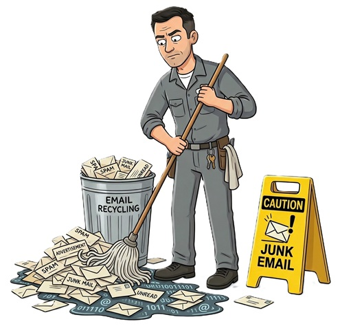

<p align="center">
  
</p>

# 🧹 Jumpsuit - Mail Mopper

## A .NET 10 CLI tool for Gmail inbox cleanup.

The Janitor's hybrid classification pipeline (rule-based + ML.NET) sorts through the mess, then lets you review everything in an interactive TUI before a single email hits the trash.

> *"Hey. Hey - stop walking. I know you saw me, Scooter.*
>
> *You know what I found in your inbox? Sixty thousand emails. Sixty. Thousand. I once found a raccoon living in the west wing air duct and that was less of a mess than this. You've got newsletters from 2014 in there. Coupons that expired during the Obama administration. LinkedIn notifications from people who are probably dead now. It's disgusting.*
>
> *So I built something. I call it the Mail Mopper. Part rules engine, part machine learning, part mop. I attached an algorithm to a bucket and taught it to sort junk. Took me three weekends and I had to learn C#, which, honestly, was easier than getting the knot out of the east stairwell drain last Tuesday.*
>
> *Here's how it works: I sweep through your inbox, sort the garbage from the not-garbage, and then you - yes, you - get to review it all before anything goes in the trash. Because I know how you are. You'll panic. You'll say 'oh no, what about my Pottery Barn receipt from 2019.' It'll still be in the trash for thirty days. Relax.*
>
> *Now are you gonna let me mop, or are you just gonna stand there holding that door?"*
>
> - **The Janitor**

---

## ✨ What the Mop Does

- 📬 **Fetches email metadata** (headers only - I'm not reading your diary, Bambi) into a local SQLite database
- 🧠 **Hybrid classification**: rule-based engine slaps labels on the obvious junk, then a locally-trained ML.NET classifier handles the rest - like having a smarter mop
- 🖥️ **Interactive TUI review**: browse by category → sender → email subjects. You get final say, even though I'm always right
- 🛡️ **Safe**: moves to Trash only (recoverable 30 days). I'm a janitor, not a monster
- 🔄 **Incremental sync**: only fetches new emails on re-runs. I'm efficient, unlike Dr. Dorian
- 📋 **Full audit log** with undo support - because *somebody* always panics
- ⚡ **Handles 60,000+ emails** efficiently with batching and rate limiting. I've seen worse. Way worse.

## 📋 Prerequisites

- .NET 10 SDK
- Gmail API OAuth2 credentials (from Google Cloud Console)

## 🔧 Setup

### 1. Google Cloud Console setup

Look, even a doctor could do this part:

1. Go to https://console.cloud.google.com/
2. Create a new project (or select existing)
3. Enable the Gmail API
4. Create OAuth 2.0 Client ID → Desktop application
5. Download the JSON credentials file
6. Save as `credentials.json` in the project directory

### 2. Build

```
dotnet build
```

## 🧹 Usage

Show all available commands:

```
dotnet run --project src/GmailCleanup -- --help
```

### The Full Mopping Procedure

Follow these steps in order, sport. I'm not explaining them twice.

```bash
dotnet run --project src/GmailCleanup -- auth           # 1. Badge in - authenticate with Gmail
dotnet run --project src/GmailCleanup -- fetch          # 2. Survey the mess - fetch email metadata
dotnet run --project src/GmailCleanup -- classify --skip-ml  # 3. First pass with the push broom (rules only)
dotnet run --project src/GmailCleanup -- train          # 4. Teach the mop new tricks (train ML model)
dotnet run --project src/GmailCleanup -- classify       # 5. Second pass - now with the smart mop
dotnet run --project src/GmailCleanup -- review         # 6. YOU look at what I sorted. Don't mess it up
dotnet run --project src/GmailCleanup -- execute        # 7. Take out the trash. My favorite part
```

### Other Janitor Commands

```bash
dotnet run --project src/GmailCleanup -- stats          # Admire my work - show statistics
dotnet run --project src/GmailCleanup -- undo <id>      # Fine. Untrash a session. Quitter
dotnet run --project src/GmailCleanup -- run            # Full pipeline - let me handle everything
```

### Key Flags

- `--skip-ml` - Skip ML classification, just use rules. Sometimes the push broom is enough
- `--dry-run` - Preview what would happen without making changes. For the nervous types
- `--full` - Force full fetch instead of incremental. Start over from scratch, like a fresh floor

## 🧠 Classification Pipeline

Three stages. Like grief, but productive.

1. **Rule-based** (free, instant): Header analysis, domain matching, Gmail categories, subject patterns - classifies ~80% of emails. That's the push broom doing the heavy lifting
2. **ML.NET classifier** (free, local, fast): Trained on your rule-classified data, classifies the remaining emails in seconds. The smart mop. My pride and joy
3. **Human review**: Interactive TUI to approve/reject by category and sender. This is where YOU come in. Try not to break anything

### Training the ML Model

The `train` command creates a text classifier using your rule-classified emails as training data:
- Uses From + Subject + Snippet as features
- SdcaMaximumEntropy multiclass trainer with TF-IDF text featurization
- Cross-validates (5-fold) and reports per-class precision, recall, F1
- Model saved to `%LOCALAPPDATA%/GmailCleanup/email_classifier.zip`
- Can be retrained anytime as you review/reclassify more emails

## ⚙️ Configuration

- `appsettings.json` - Batch sizes, confidence thresholds
- `rules/default-rules.json` - Customizable classification rules. My mopping playbook

## 💾 Data Storage

All local. I don't trust the cloud and neither should you.

- SQLite database at `%LOCALAPPDATA%/GmailCleanup/gmail_cleanup.db`
- ML model at `%LOCALAPPDATA%/GmailCleanup/email_classifier.zip`
- All data stored locally - no external API calls during classification

## 🛡️ Safety Features

I may look reckless, but I'm a professional.

- **Dry-run mode by default** - nothing happens until you say so
- **Move to Trash only** - Gmail retains for 30 days. Plenty of time for regrets
- **Sender/domain whitelist** - protect the important stuff
- **Full audit log per session** - receipts for everything
- **Undo command** - because I knew you'd need it, Newbie
